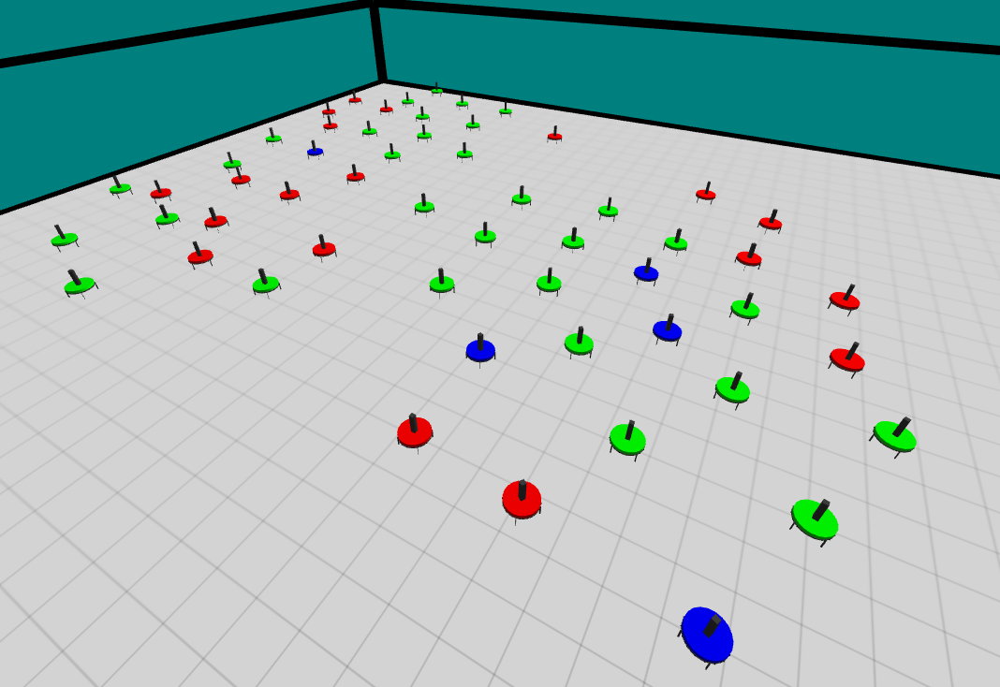

# swarm-apocalypse

This is a private repo for the work of the paper "Decentralised  Control  of  Malware  Infection  Dissemination  inAutonomous  Agent  Swarm  Systems".




**INTRODUCTION**

In this package you'll find some basic simulation to start using ARGoS.

To run an experiment with ARGoS, you need to define two things:
1. the robot controllers
2. the experiment configuration

You find example controllers in the controllers/ directory. The
experiment configuration files are located in the experiments/
directory.


**COMPILATION**

In principle, you can compile your code however you want. In practice,
the help of a build system makes your work much easier. In ARGoS, and
in these examples, we use CMake. To compile the examples, open up a
shell, go to the directory where you unpacked the tar.bz2 file and
type:
```
$ mkdir build
$ cd build
```
To produce debuggable code (slow), type:
```
$ cmake -DCMAKE_BUILD_TYPE=Debug ..
```
To produce fast but not debuggable code, type:
```
$ cmake -DCMAKE_BUILD_TYPE=Release ..
```
Finally, launch the compilation with the command:
```
$ make
```
If you find no error, you're ready to go to the next phase.

**RUNNING THE EXAMPLE**

To run an example, the configuration files have been written with the
hypothesis that you run them in the directory where you unpacked the
tar.bz2, NOT in the build/ directory. Therefore, go to that directory
and type:

```
$ argos3 -c experiments/eyebot_apocalypse.argos
```

## Experiment #1:
In this experiment, we experiment with only healthy agents. The target of the experiment is to test the Lennard-Jones model with different parameters to identify the best parameters for simulation.


## Experiment #2:
In this experiment, we experiment with only healthy and infected agents. The target of the experiment is to test the interaction between them. Different parameters are considered in this experiment such as symptoms infection time, terminal infection time, infection distance, and population infection percentage.


## Experiment #3:
In this experiment, we experiment with medic, healthy, and infected agents. The target of the experiment is to test the effect of adding medics on the population and how to make them survive. Different parameters are considered such as curing distance and curing time.
